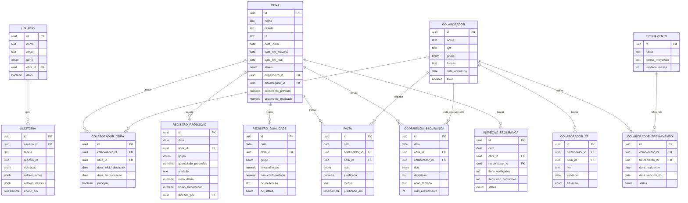

# Estrutura do banco de dados — Gestão da Produção

PostgreSQL, esquema relacional. Este documento é a fonte de verdade da modelagem;
os arquivos em `data/processed/*.json` são uma *amostra* gerada a partir de um
subconjunto destas tabelas, usada apenas para a demonstração estática.

## Diagrama ER



## Tabelas

### `obra`
| Campo | Tipo | Observações |
|---|---|---|
| id | uuid PK | |
| nome | text | |
| cidade, uf | text | |
| data_inicio | date | |
| data_fim_prevista | date | |
| data_fim_real | date, nullable | preenchido ao concluir |
| status | enum(`planejada`,`em_execucao`,`concluida`,`suspensa`) | |
| engenheiro_id | uuid FK → usuario | responsável técnico |
| encarregado_id | uuid FK → usuario | responsável de campo |
| orcamento_previsto | numeric(14,2) | |
| orcamento_realizado | numeric(14,2) | atualizado por integração financeira ou lançamento manual |

### `colaborador`
| Campo | Tipo | Observações |
|---|---|---|
| id | uuid PK | |
| nome | text | |
| cpf | text, unique | |
| grupo | enum(`estrutura`,`alvenaria`,`acabamento`,`administrativo`) | departamento/disciplina |
| funcao | text | ex.: "Pedreiro", "Armador" |
| data_admissao | date | |
| ativo | boolean | soft-delete lógico; nunca apagar fisicamente (histórico) |

### `colaborador_obra` (histórico de alocação — resolve N:N)
| Campo | Tipo | Observações |
|---|---|---|
| id | uuid PK | |
| colaborador_id | uuid FK | |
| obra_id | uuid FK | |
| data_inicio_alocacao | date | |
| data_fim_alocacao | date, nullable | null = alocação corrente |
| principal | boolean | marca a obra "dona" do colaborador quando há mais de uma ativa |

Um colaborador pode ter várias linhas simultâneas (ex.: técnico de segurança
compartilhado entre obras); a obra "principal" concentra o vínculo trabalhista.

### `registro_producao` (apontamento diário)
| Campo | Tipo | Observações |
|---|---|---|
| id | uuid PK | |
| data | date | |
| obra_id | uuid FK | |
| grupo | enum | mesmo domínio de `colaborador.grupo` |
| quantidade_produzida | numeric(10,2) | |
| unidade | text | m², m³, unidade, etc. |
| meta_diaria | numeric(10,2) | meta planejada para o grupo/dia |
| horas_trabalhadas | numeric(6,2) | soma da equipe do grupo naquele dia |
| lancado_por | uuid FK → usuario | auditoria de quem apontou |

Chave de negócio única: `(data, obra_id, grupo)` — um apontamento consolidado
por grupo e dia (o detalhamento por colaborador fica no apontamento de RH,
fora do escopo deste MVP).

### `registro_qualidade`
| Campo | Tipo | Observações |
|---|---|---|
| id | uuid PK | |
| data | date | |
| obra_id | uuid FK | |
| grupo | enum | |
| retrabalho_pct | numeric(5,2) | % de horas/serviço refeitas no dia |
| nao_conformidade | boolean | |
| nc_descricao | text, nullable | |
| nc_status | enum(`aberta`,`em_correcao`,`corrigida`), nullable | |

### `falta`
| Campo | Tipo | Observações |
|---|---|---|
| id | uuid PK | |
| data | date | |
| colaborador_id | uuid FK | |
| obra_id | uuid FK | |
| tipo | enum(`falta`,`atraso`,`saida_antecipada`) | |
| justificada | boolean | |
| motivo | text, nullable | null = pendente de justificativa |
| justificado_em | timestamptz, nullable | |

### `ocorrencia_seguranca`
| Campo | Tipo | Observações |
|---|---|---|
| id | uuid PK | |
| data | date | |
| obra_id | uuid FK | |
| colaborador_id | uuid FK, nullable | pode ser null (ocorrência sem vítima) |
| tipo | enum(`quase_acidente`,`acidente_leve`,`acidente_grave`) | |
| descricao | text | |
| acao_tomada | text | |
| dias_afastamento | int, default 0 | |

### `colaborador_epi`
| Campo | Tipo | Observações |
|---|---|---|
| id | uuid PK | |
| colaborador_id | uuid FK | |
| obra_id | uuid FK | |
| item | text | ex.: "Capacete", "Cinto de segurança" |
| validade | date | |
| situacao | enum(`ok`,`vencido`,`faltando`) | calculado ou lançado manualmente |

### `treinamento` / `colaborador_treinamento`
Catálogo de treinamentos (NR-35, NR-18, NR-06, NR-10, Brigada de Incêndio…) e
o registro de realização por colaborador, com `data_vencimento` calculada a
partir de `treinamento.validade_meses`.

### `inspecao_seguranca`
Checklist periódico de canteiro (itens verificados x não conformes), status
consolidado (`conforme`, `conforme_com_ressalvas`, `nao_conforme`).

### `usuario`
| Campo | Tipo | Observações |
|---|---|---|
| id | uuid PK | |
| nome, email | text | |
| perfil | enum(`admin`,`gestor`,`supervisor`) | ver regras de permissão abaixo |
| obra_id | uuid FK, nullable | obrigatório quando `perfil = supervisor` (escopo de acesso) |
| ativo | boolean | |

### `auditoria`
Log append-only de qualquer `INSERT`/`UPDATE`/`DELETE` em tabelas sensíveis
(`registro_producao`, `falta`, `ocorrencia_seguranca`, `colaborador`),
guardando `valores_antes`/`valores_depois` em `jsonb` — atende ao requisito de
"histórico auditável de alterações".

## Regras de permissão por perfil

| Perfil | Escopo de obras | Produtividade individual | Edição de cadastro | Auditoria |
|---|---|---|---|---|
| `admin` | todas | sim | sim | sim |
| `gestor` | todas | sim | sim | não |
| `supervisor` | apenas `usuario.obra_id` | não | apontamento diário da própria obra | não |

## DDL (PostgreSQL)

```sql
create type grupo_colaborador as enum ('estrutura','alvenaria','acabamento','administrativo');
create type status_obra as enum ('planejada','em_execucao','concluida','suspensa');
create type perfil_usuario as enum ('admin','gestor','supervisor');
create type tipo_falta as enum ('falta','atraso','saida_antecipada');
create type status_nc as enum ('aberta','em_correcao','corrigida');
create type tipo_ocorrencia as enum ('quase_acidente','acidente_leve','acidente_grave');
create type situacao_epi as enum ('ok','vencido','faltando');
create type status_inspecao as enum ('conforme','conforme_com_ressalvas','nao_conforme');

create table usuario (
  id uuid primary key default gen_random_uuid(),
  nome text not null,
  email text not null unique,
  senha_hash text not null,
  perfil perfil_usuario not null,
  obra_id uuid,               -- FK abaixo (obra ainda não existe neste ponto do script)
  ativo boolean not null default true,
  criado_em timestamptz not null default now()
);

create table obra (
  id uuid primary key default gen_random_uuid(),
  nome text not null,
  cidade text not null,
  uf char(2) not null,
  data_inicio date not null,
  data_fim_prevista date not null,
  data_fim_real date,
  status status_obra not null default 'planejada',
  engenheiro_id uuid references usuario(id),
  encarregado_id uuid references usuario(id),
  orcamento_previsto numeric(14,2) not null,
  orcamento_realizado numeric(14,2) not null default 0,
  criado_em timestamptz not null default now()
);

alter table usuario add constraint fk_usuario_obra foreign key (obra_id) references obra(id);
alter table usuario add constraint chk_supervisor_tem_obra
  check (perfil <> 'supervisor' or obra_id is not null);

create table colaborador (
  id uuid primary key default gen_random_uuid(),
  nome text not null,
  cpf char(11) not null unique,
  grupo grupo_colaborador not null,
  funcao text not null,
  data_admissao date not null,
  ativo boolean not null default true
);

create table colaborador_obra (
  id uuid primary key default gen_random_uuid(),
  colaborador_id uuid not null references colaborador(id),
  obra_id uuid not null references obra(id),
  data_inicio_alocacao date not null,
  data_fim_alocacao date,
  principal boolean not null default true
);
create index idx_colaborador_obra_obra on colaborador_obra(obra_id) where data_fim_alocacao is null;

create table registro_producao (
  id uuid primary key default gen_random_uuid(),
  data date not null,
  obra_id uuid not null references obra(id),
  grupo grupo_colaborador not null,
  quantidade_produzida numeric(10,2) not null,
  unidade text not null,
  meta_diaria numeric(10,2) not null,
  horas_trabalhadas numeric(6,2) not null,
  lancado_por uuid references usuario(id),
  criado_em timestamptz not null default now(),
  unique (data, obra_id, grupo)
);
create index idx_producao_obra_data on registro_producao(obra_id, data);

create table registro_qualidade (
  id uuid primary key default gen_random_uuid(),
  data date not null,
  obra_id uuid not null references obra(id),
  grupo grupo_colaborador not null,
  retrabalho_pct numeric(5,2) not null default 0,
  nao_conformidade boolean not null default false,
  nc_descricao text,
  nc_status status_nc,
  check (not nao_conformidade or nc_status is not null)
);
create index idx_qualidade_obra_data on registro_qualidade(obra_id, data);

create table falta (
  id uuid primary key default gen_random_uuid(),
  data date not null,
  colaborador_id uuid not null references colaborador(id),
  obra_id uuid not null references obra(id),
  tipo tipo_falta not null,
  justificada boolean not null default false,
  motivo text,
  justificado_em timestamptz
);
create index idx_falta_obra_data on falta(obra_id, data);
create index idx_falta_colaborador on falta(colaborador_id);

create table ocorrencia_seguranca (
  id uuid primary key default gen_random_uuid(),
  data date not null,
  obra_id uuid not null references obra(id),
  colaborador_id uuid references colaborador(id),
  tipo tipo_ocorrencia not null,
  descricao text not null,
  acao_tomada text,
  dias_afastamento int not null default 0
);
create index idx_ocorrencia_obra_data on ocorrencia_seguranca(obra_id, data);

create table colaborador_epi (
  id uuid primary key default gen_random_uuid(),
  colaborador_id uuid not null references colaborador(id),
  obra_id uuid not null references obra(id),
  item text not null,
  validade date not null,
  situacao situacao_epi not null default 'ok'
);

create table treinamento (
  id uuid primary key default gen_random_uuid(),
  nome text not null,
  norma_referencia text,
  validade_meses int not null
);

create table colaborador_treinamento (
  id uuid primary key default gen_random_uuid(),
  colaborador_id uuid not null references colaborador(id),
  treinamento_id uuid not null references treinamento(id),
  data_realizacao date not null,
  data_vencimento date not null,
  status text not null default 'valido'
);

create table inspecao_seguranca (
  id uuid primary key default gen_random_uuid(),
  data date not null,
  obra_id uuid not null references obra(id),
  responsavel_id uuid references usuario(id),
  itens_verificados int not null,
  itens_nao_conformes int not null default 0,
  status status_inspecao not null
);

create table auditoria (
  id uuid primary key default gen_random_uuid(),
  usuario_id uuid references usuario(id),
  tabela text not null,
  registro_id uuid not null,
  operacao text not null check (operacao in ('insert','update','delete')),
  valores_antes jsonb,
  valores_depois jsonb,
  criado_em timestamptz not null default now()
);
create index idx_auditoria_tabela_registro on auditoria(tabela, registro_id);
```

## Notas de implementação

- **Fuso e datas**: todo campo `date` representa o dia operacional da obra
  (sem componente de hora); campos de auditoria usam `timestamptz`.
- **Cálculo de índices** (produtividade, absenteísmo, índice de frequência de
  acidentes) deve viver em *views* ou numa camada de agregação (ex.: `materialized
  view` atualizada no fechamento diário), não em lógica duplicada no front-end —
  o front-end estático deste protótipo replica esse cálculo em `js/*.js` apenas
  para fins de demonstração.
- **Exclusão lógica**: `colaborador.ativo` e `obra.status` nunca resultam em
  `DELETE`; histórico de produção/faltas/segurança deve sobreviver ao
  desligamento de um colaborador.
- **Multi-obra**: um colaborador administrativo (ex.: técnico de segurança)
  pode ter múltiplas linhas abertas em `colaborador_obra` simultaneamente.
