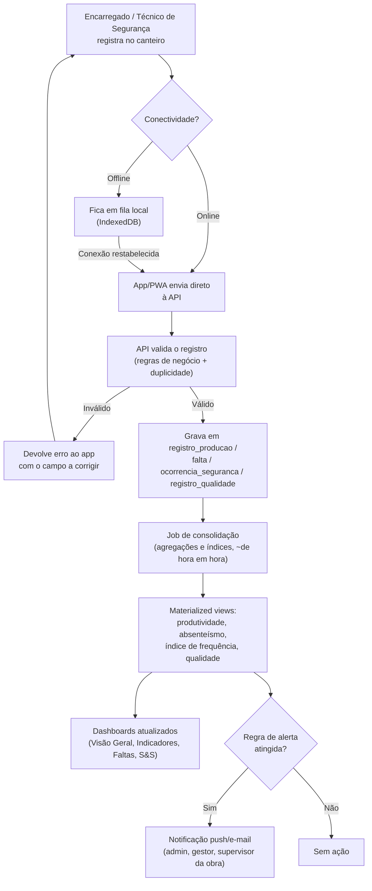
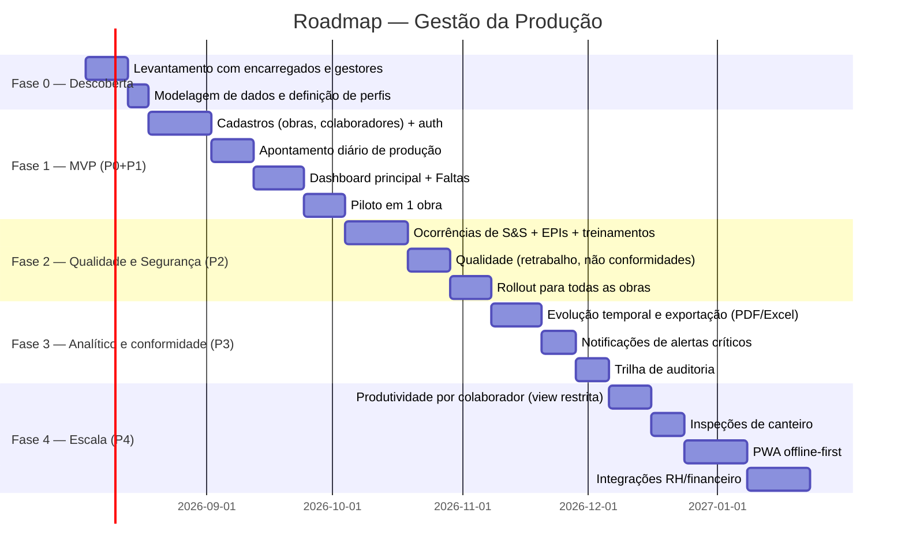

# Funcionalidades, fluxo de atualização diária e roadmap

## Funcionalidades prioritárias

Priorização por valor de negócio (visibilidade gerencial e obrigações
legais de S&S vêm primeiro) e por dependência técnica (não dá para medir
produtividade sem cadastro de obras/colaboradores).

### P0 — Fundação (pré-requisito de tudo)
- Cadastro de obras (CRUD, responsáveis, orçamento previsto)
- Cadastro de colaboradores + histórico de alocação por obra/grupo
- Autenticação com perfis (admin, gestor, supervisor) e escopo de obra por perfil
- Apontamento diário de produção (quantidade x meta, horas trabalhadas)

### P1 — Visibilidade gerencial (Dashboard + Faltas)
- Dashboard principal com filtros por período/obra/grupo
- Registro e listagem de faltas (falta, atraso, saída antecipada)
- Taxa de absenteísmo (global, por obra, por grupo) e identificação de padrões crônicos
- Pendências de justificativa de falta

### P2 — Qualidade e Segurança (obrigação regulatória)
- Registro de ocorrências de S&S com categorização (quase-acidente / leve / grave)
- Índice de frequência de acidentes
- Controle de EPIs vencidos/faltando e treinamentos (NRs) pendentes
- Registro de não conformidades e retrabalho por grupo

### P3 — Analítico e conformidade
- Evolução temporal / tendências (produtividade, retrabalho, absenteísmo)
- Exportação de relatórios (PDF, Excel)
- Notificações automáticas para alertas críticos (acidente grave, EPI vencido, NC aberta há X dias)
- Histórico auditável de alterações (trilha de auditoria)

### P4 — Escala e integração
- Visão de produtividade por colaborador (view restrita a admin/gestor)
- Relatórios de inspeção de canteiro
- Integração com sistemas de RH/folha (faltas) e financeiro (orçamento realizado)
- App/PWA offline-first para apontamento em campo sem sinal

## Fluxo de atualização diária

Dados de obra são lançados no canteiro (muitas vezes com conectividade
instável) e precisam estar consolidados nos dashboards antes do início do
expediente seguinte.

**Janela de corte diária**: os apontamentos referentes ao dia `D` devem ser
lançados até as 08h00 do dia `D+1` (início do expediente); o job de
consolidação roda a cada hora durante o expediente e uma vez de madrugada
para o fechamento definitivo do dia — o dashboard sempre mostra "última
atualização às HH:MM" para deixar clara a defasagem.

**Regras de alerta (exemplos)**: acidente grave → notificação imediata;
EPI vencido há mais de 5 dias → alerta diário até regularização; não
conformidade aberta há mais de 3 dias → escalonamento ao gestor; taxa de
absenteísmo de um grupo acima de 8% na semana → alerta ao gestor da obra.

## Roadmap de implementação

| Fase | Duração estimada | Entrega principal |
|---|---|---|
| 0 — Descoberta | ~3 semanas | Modelo de dados validado com o time de campo |
| 1 — MVP | ~9 semanas | Obras, colaboradores, apontamento, dashboard e faltas em produção numa obra-piloto |
| 2 — Qualidade e Segurança | ~7 semanas | Módulo de S&S completo, rollout para todas as obras |
| 3 — Analítico e conformidade | ~5,5 semanas | Relatórios exportáveis, alertas automáticos, auditoria |
| 4 — Escala | ~7 semanas | Visão individual, inspeções, app offline, integrações |

O piloto em uma única obra ao fim da Fase 1 é o ponto de decisão: valida se
o fluxo de apontamento diário é rápido o suficiente para o encarregado usar
todo dia antes de investir nas fases seguintes.
